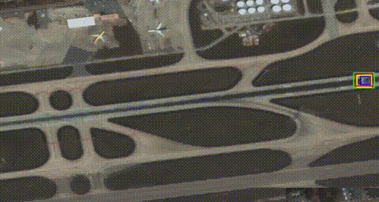

# High-resolution Satellite Video Object Tracking Based on ThickSiam Framework

## Introduction

High-resolution satellite videos are playing an increasingly important role as a means of monitoring dynamic ground targets. Currently, satellite video object tracking is confronted with small size, partial occlusion, residual shadow, poor target-background discriminability, shape deformation and poor general field illumination challenges. To solve the above problems, we design a ThickSiam framework, which consists of a Thickened Residual Block Siamese Network (TRBS-Net) and an Improved Kalman Filter (IKF) module. The TRBSNet is stacked by well-designed thickened residual blocks and thickened maxpooling residual block, while the IKF module is designed to simultaneously correct the trajectory and size of the target. We propose an N-frame-convergence mechanism to deal with the burn-in period problem existed in IKF module and weightedly combine the results of TRBS-Net and IKF modules. We also construct a testing dataset suitable for satellite video object tracking task. We conducted ablation experiments on the constructed dataset and compared the proposed ThickSiam framework with other nineteen state-of-the-art trackers including different features and backbones. The comparison results show that our ThickSiam tracker obtained a precision value of 0.991 and a success value of 0.755 with a frames per second (FPS) value of 56.849 implemented on a single NVIDIA GTX1070Ti GPU.

## Main Results

We compared the ThickSiam Framework with other 19 state-of-the-art trackers including CF-based and DL-based methods with different features and backbones. They are MOSSE, CSK, KCF, CN, DSST, Staple, SiamFC, DCFNet, ECO, STRCF, ATOM, DiMP, SiamFC+, SiamRPN+, SiamRPN++, SiamFC++ and ID-DSN. The comparison results are shown in the following Table.

| Trackers                       | Methods  | Features             | Backbones                       | CUDA | Precision | Success | FPS     |
|--------------------------------|----------|----------------------|---------------------------------|------|-----------|---------|---------|
| MOSSE(2010)                    | CF-based |  Grayscale Intensity | -                               | - | 0.745     | 0.48    | 4.964   |
| CSK(2012)                      | CF-based |  Grayscale Intensity | -                               | - | 0.755     | 0.512   | 5.478   |
| KCF(2014)                      | CF-based | HOG                  | -                               | - | 0.851     | 0.634   | 18.21   |
| CN(2014)                       | CF-based | Color Table          | -                               | - | 0.859     | 0.609   | 8.763   |
| DSST(2014)                     | CF-based | HOG                  | -                               | - | 0.782     | 0.596   | 9.72    |
| Staple(2016)                   | CF-based | HOG+Color Histogram  | -                               | - | 0.776     | 0.58    | 10.887  |
| SiamFC                         | DL-based | CNN Features         | AlexNet                         | - [x] | 0.902     | 0.663   | 127.174 |
| DCFNet(2017)                   | CF-based | CNN Features         | conv1 from VGG                  | - [x] | 0.833     | 0.644   | 12.4    |
| ECO(2017)                      | CF-based | CNN Features         | ResNet18 with vgg-m conv1 layer | - | 0.856     | 0.645   | 3.998   |
| STRCF(2018)                    | CF-based | HOG+Color Table      | -                               | - | 0.795     | 0.557   | 7.498   |
| ATOM(2019)                     | DL-based | CNN Features         | ResNet18                        | - [x] | 0.852     | 0.622   | 10.771  |
| DiMP(2019)                     | DL-based | CNN Features         | ResNet18                        | - [x] | 0.717     | 0.545   | 12.697  |
| DiMP(2019)                     | DL-based | CNN Features         | ResNet50                        | - [x] | 0.747     | 0.597   | 11.239  |
| SiamFC+(2019)                  | DL-based | CNN Features         | ResNet22                        | - [x] | 0.839     | 0.652   | 59.333  |
| SIamRPN+(2019)                 | DL-based | CNN Features         | ResNet22                        | - [x] | 0.878     | 0.618   | 114.867 |
| SiamRPN++(2019)                | DL-based | CNN Features         | AlexNet                         | - [x] | 0.883     | 0.656   | 144.783 |
| SiamRPN++(2019)                | DL-based | CNN Features         | ResNet50                        | - [x] | 0.828     | 0.655   | 31.617  |
| SiamFC++(2020)                 | DL-based | CNN Features         | AlexNet                         | - [x] | 0.925     | 0.699   | 139.828 |
| ID-DSN（2021）                  | DL-based | CNN Features         | ResNet50                        | - [x] | 0.933     | 0.718   | 31.167  |
| ThickSiam (ours, TRBS-Net)     | DL-based | CNN Features         | TRB+TMRB                        | - [x] | 0.959     | 0.721   | 56.758  |
| ThickSiam (ours, TRBS-Net+IKF) | DL-based | CNN Features         | TRB+TMRB                        | - [x] | 0.991     | 0.755   | 56.758  |

## Dataset
Coming soon

## Installation 
Coming soon

## Quick Start
Coming soon

## License
Licensed under an MIT license.
